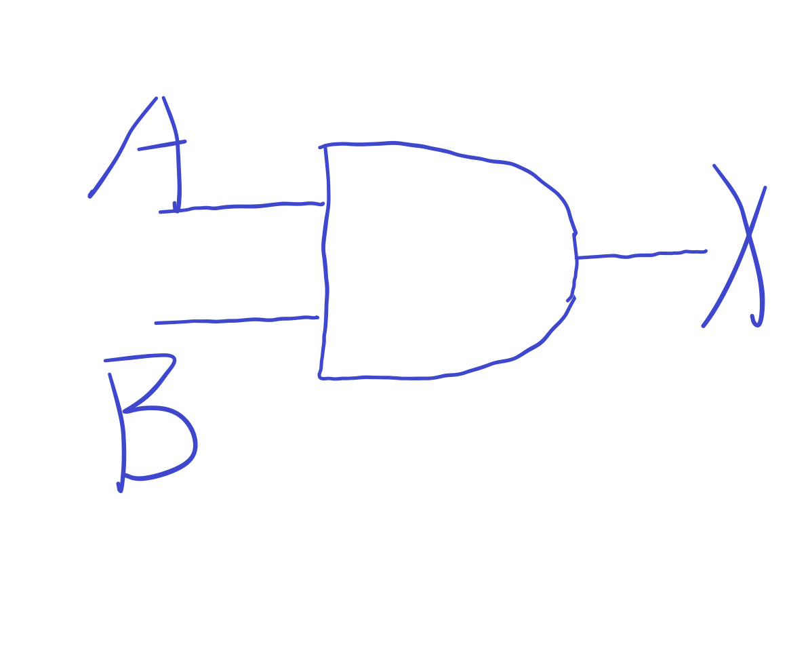
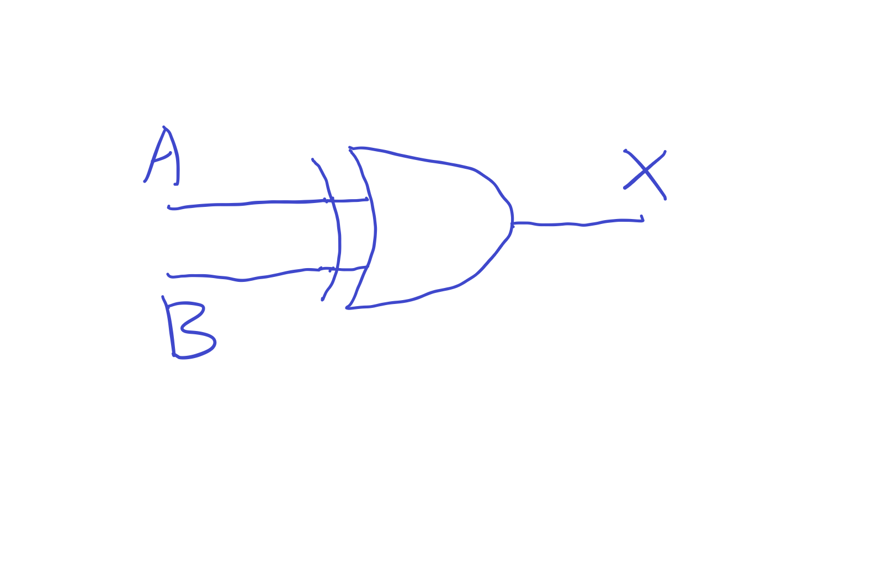

# 作业part 1
## 1)AND Gate三种表示
 1. 真值表 Truth Table
 | A | B | X | 
 | - | - | - | 
 | 0 | 0 | 0 | 
 | 1 | 0 | 0 | 
 | 0 | 1 | 0 |
 | 1 | 1 | 1 |

 2. 布尔表达式 Boolean Expression
 X = A*B

 3. 逻辑图 Logic Diagram Symbol

### AND意味着只有在两个输入都是高电平的情况下才输出高电平。
## 2)XOR Gate三种表示
1. 真值表 Truth Table
 | A | B | X | 
 | - | - | - | 
 | 0 | 0 | 0 | 
 | 1 | 0 | 1 | 
 | 0 | 1 | 1 |
 | 1 | 1 | 0 |

 2. 布尔表达式 Boolean Expression
 X = A⊕B

 3. 逻辑图 Logic Diagram Symbol

### AND意味着在两个输入电平不同的情况下输出高电平1，否则输出低电平0.
## 3）画电路图表示 (A + B)(B + C)
(B+C).png)
## 4）真值表表示图示电路
 | A | B | X | 
 | - | - | - | 
 | 0 | 0 | 1 | 
 | 1 | 0 | 0 | 
 | 0 | 1 | 1 |
 | 1 | 1 | 1 |
## 5）
### Circuit equivalence means that when the inputs are the same,the two circuits have the same out puts.当两个电路的输入相同时，它们的输出也相同。
 #### （）
 | A | B | X | 
 | - | - | - | 
 | 0 | 0 | 1 | 
 | 1 | 0 | 0 | 
 | 0 | 1 | 1 |
 | 1 | 1 | 1 |