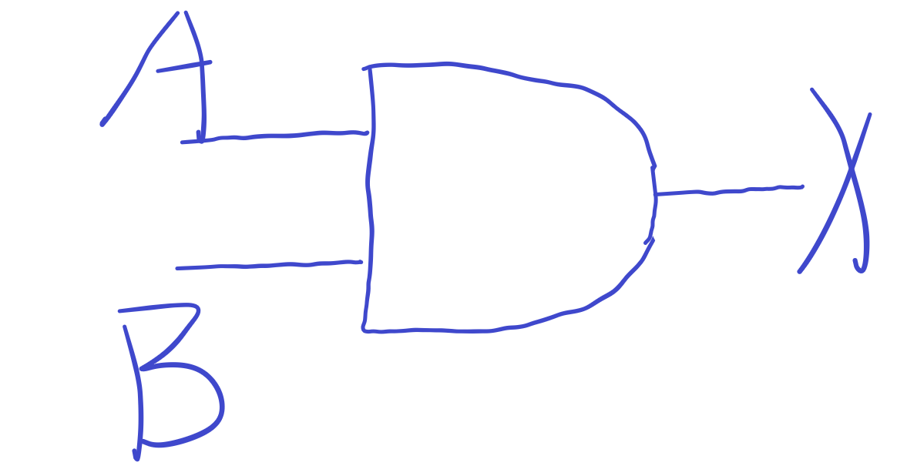
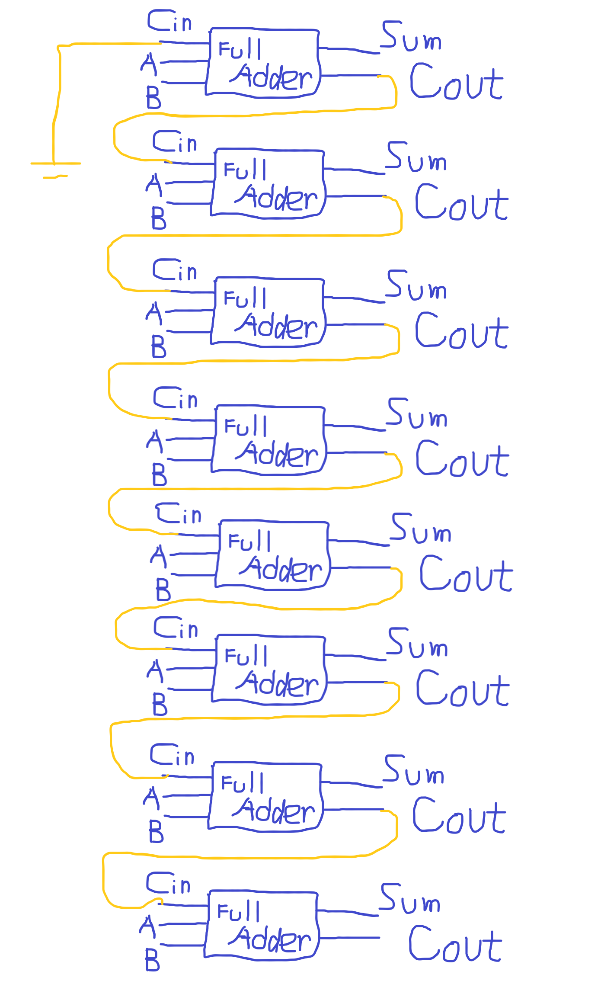

# 作业part 1
## 1)AND Gate三种表示
 1. 真值表 Truth Table
 | A | B | X | 
 | - | - | - | 
 | 0 | 0 | 0 | 
 | 1 | 0 | 0 | 
 | 0 | 1 | 0 |
 | 1 | 1 | 1 |

 2. 布尔表达式 Boolean Expression
 X = A*B

 3. 逻辑图 Logic Diagram Symbol

### AND意味着只有在两个输入都是高电平的情况下才输出高电平。
## 2)XOR Gate三种表示
1. 真值表 Truth Table
 | A | B | X | 
 | - | - | - | 
 | 0 | 0 | 0 | 
 | 1 | 0 | 1 | 
 | 0 | 1 | 1 |
 | 1 | 1 | 0 |

 2. 布尔表达式 Boolean Expression
 X = A⊕B

 3. 逻辑图 Logic Diagram Symbol

### AND意味着在两个输入电平不同的情况下输出高电平1，否则输出低电平0.
## 3）画电路图表示 (A + B)(B + C)
(B+C)1.png)
## 4）真值表表示图示电路
 | A | B | X | 
 | -- | -- | -- | 
 | 0 | 0 | 1 | 
 | 1 | 0 | 0 | 
 | 0 | 1 | 1 |
 | 1 | 1 | 1 |
## 5）
### Circuit equivalence means that when the inputs are the same,the two circuits have the same out puts.当两个电路的所有输入的组合相同时，它们的输出也相同。
 #### （AB）'= A'+B'的真值表证明：
 | A | B | A' | B' | A'+B' | AB | (AB)' |
 | -- | -- | -- | -- | -- | -- | -- |
 | 0 | 0 | 1 | 1 | 1 | 0 | 1 |
 | 1 | 0 | 0 | 1 | 1 | 0 | 1 |
 | 0 | 1 | 1 | 0 | 1 | 1 | 1 |
 | 1 | 1 | 0 | 0 | 0 | 0 | 0 |
 # 作业part 2

 ## 6）
 

 ## 7）
### (1) (X8X7X6X5X4X3X2X1)2 or (00001111)2 = (X8X7X6X5X4X3X2X1)2
### (2) (X8X7X6X5X4X3X2X1)2 xor (00001111)2 = (X8X7X6X50000)2
### (3) ((X8X7X6X5X4X3X2X1)2 and (11110000)2 ) or (not (X8X7X6X5X4X3X2X1)2 and (00001111)2) = (X8X7X6X5X4'X3'X2'X1')2

# 作业part 3
## 解释概念
### 1） Logic gate 逻辑门
In electronics, a logic gate is an idealized or physical device implementing a Boolean function; that is, it performs a logical operation on one or more binary inputs and produces a single binary output.在电子学中，逻辑门是实现布尔函数的理想化或物理设备，它对一个或多个二进制输入执行逻辑运算并产生单个二进制输出。
### 2） Boolean algebra 布尔代数
In mathematics and mathematical logic, Boolean algebra is the branch of algebra in which the values of the variables are the truth values true and false, usually denoted 1 and 0 respectively. The main operations of Boolean algebra are the conjunction and denoted as ∧, the disjunction or denoted as ∨, and the negation not denoted as ¬.在数学和数学逻辑中，布尔代数是代数的一个分支，其变量的值叫真值，有真和假，通常分别表示为1和0。布尔代数的主要操作可用连词表示，AND与表示为∧，OR或表示为∨，而NOT非表示为¬。
## 自学存储电路
1. Flip-flop 中文翻译是“触发器”
2. Only one bit.
