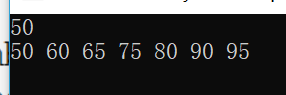
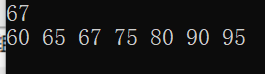
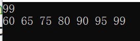

# 作业
## 1. Bubble Sort the list: 33, 56, 17, 8, 95, 22。Make sure the final result is from small to large. Write out the list after the 2nd pass. (10 points) 

 <table>
        <tr>
            <th>步骤</th>
            <th>第一位</th>
            <th>第二位</th>
            <th>第三位</th>
            <th>第四位</th>
            <th>第五位</th>
            <th>第六位</th>
        </tr>
        <tr>
            <th>第一次</th>
            <th>33</th>
            <th>56</th>
            <th>17</th>
            <th>8</th>
            <th>95</th>
            <th>22</th>
        </tr>
        <tr>
            <th>第二次</th>
            <th>33</th>
            <th>17</th>
            <th>56</th>
            <th>8</th>
            <th>95</th>
            <th>22</th>
        </tr>
        <tr>
            <th>第三次</th>
            <th>33</th>
            <th>17</th>
            <th>8</th>
            <th>56</th>
            <th>95</th>
            <th>22</th>
        </tr>
        <tr>
            <th>第四次</th>
            <th>33</th>
            <th>17</th>
            <th>8</th>
            <th>56</th>
            <th>95</th>
            <th>22</th>
        </tr>
        <tr>
            <th>第五次</th>
            <th>33</th>
            <th>17</th>
            <th>8</th>
            <th>56</th>
            <th>22</th>
            <th>95</th>
        </tr>
        <tr>
            <th>第六次</th>
            <th>17</th>
            <th>33</th>
            <th>8</th>
            <th>56</th>
            <th>22</th>
            <th>95</th>
        </tr>
        <tr>
            <th>第七次</th>
            <th>17</th>
            <th>8</th>
            <th>33</th>
            <th>56</th>
            <th>22</th>
            <th>95</th>
        </tr>
        <tr>
            <th>第八次</th>
            <th>17</th>
            <th>8</th>
            <th>33</th>
            <th>56</th>
            <th>22</th>
            <th>95</th>
        </tr>
        <tr>
            <th>第九次</th>
            <th>17</th>
            <th>8</th>
            <th>33</th>
            <th>22</th>
            <th>56</th>
            <th>95</th>
        </tr>
        <tr>
            <th>第十次</th>
            <th>17</th>
            <th>8</th>
            <th>33</th>
            <th>22</th>
            <th>56</th>
            <th>95</th>
        </tr>
        <tr>
            <th>第十一次</th>
            <th>8</th>
            <th>17</th>
            <th>33</th>
            <th>22</th>
            <th>56</th>
            <th>95</th>
        </tr>
        <tr>
            <th>第十二次</th>
            <th>8</th>
            <th>17</th>
            <th>33</th>
            <th>22</th>
            <th>56</th>
            <th>95</th>
        </tr>
        <tr>
            <th>第十三次</th>
            <th>8</th>
            <th>17</th>
            <th>22</th>
            <th>33</th>
            <th>56</th>
            <th>95</th>
        </tr>
        <tr>
            <th>第十四次</th>
            <th>8</th>
            <th>17</th>
            <th>22</th>
            <th>33</th>
            <th>56</th>
            <th>95</th>
        </tr>
         <tr>
            <th>第十五次</th>
            <th>8</th>
            <th>17</th>
            <th>22</th>
            <th>33</th>
            <th>56</th>
            <th>95</th>
        </tr>      
    </table>

## 2. Give a sorted array as list={60,65,75,80,90,95}. Design an algorithm to insert the value of x into the sorted array. Then test the algorithm with value 50,67,99.

    #include<stdio.h>
    int array0[6]={60,65,75,80,90,95};
    int main()
    {
	    int i,j,l;
	    int number;
    	int array[7];
    	scanf("%d",&number);
    	for(i=0;i<6;i++)
    	if(number<=array0[0])
    	{
    		j=0;
    	}else if(number>=array0[i])
	    {
		    j=i+1;
	    }
	
    	if(j==0)
	    {
		    array[0]=number;
	    	for(int k=1;k<7;k++)
		    {
			    array[k]=array0[k-1];
		    }
	    }
    	else 
	    {
		    for(l=0;l<j;l++)
		    {
			    array[l]=array0[l];
    		}
	    	array[l]=number;
		    for(int m =l+1;m<7;m++)
		    {
			    array[m]=array0[m-1];
	    	}
	    }	
	    for(int k=0;k<7;k++)
	    {
	    	printf("%d ",array[k]);
	    }
	    printf("\n");
	    return 0;
    } 

#### 测试结果：
##### 输入50：

##### 输入67：

##### 输入99：

## 思考：为什么选择插入点在list头上、中间、尾巴上的三个数作为算法测试的数据，你能解释吗？

## 挑中间的数作为测试数据，可以测试程序对一般数据的处理情况；而list的开头和结尾的数字较容易出错，如果测试了开头和结尾都没问题，那么这个程序基本上就不会出什么问题了。

## 3. What is the state of the stack after the following sequence of Push and Pop operations? Push “anne”; Push “get”; Push “your” ; Pop; Push “my” Push “gun” 

<table>
        <tr>
            <th>gun</th>
        </tr>
        <tr>
            <th>my</th>
        </tr>
        <tr>
            <th>get</th>
        </tr>
        <tr>
            <th>anne</th>
        </tr>
</table>