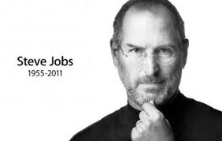
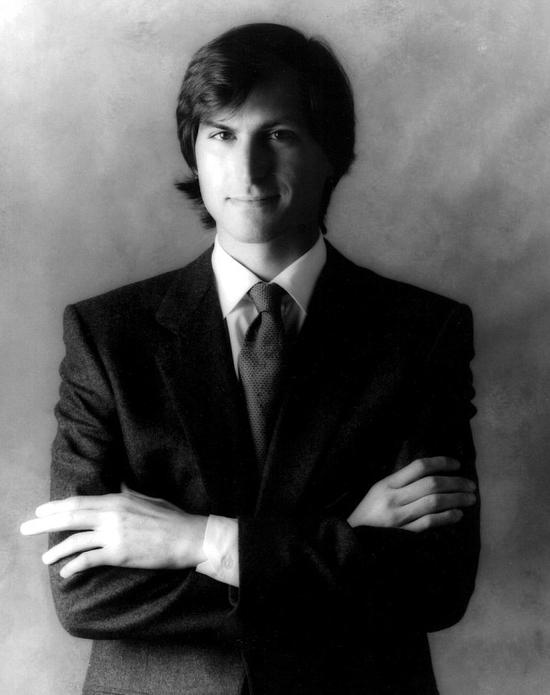
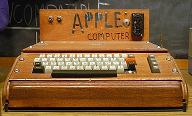
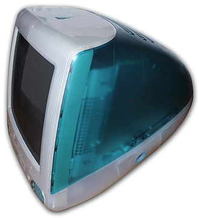
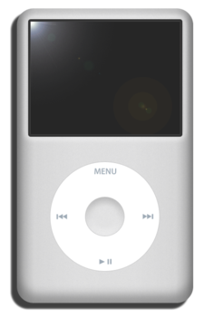

# 乔布斯生平简介
## 史蒂芬·保罗·乔布斯（英语：Steven Paul Jobs，1955年2月24日－2011年10月5日），通称史蒂夫·乔布斯（英语：Steve Jobs），是一名美国企业家、营销家和发明家，苹果公司的联合创始人之一，曾任董事长及首席执行官职位。

## 早年
### 乔布斯是未婚先孕生下的，他被领养后生活在一个蓝领家庭。成长于电子和计算机产业萌芽的时代，乔布斯的父亲（领养人）最初是一名从事改装并销售二手汽车的商人，并在乔布斯生活中经常给予他接触机械设备的机会，其后他认为自己受到家庭的影响而喜爱精密的设备。乔布斯在早年曾经 是一名智商高但不擅长学习的学生，后被其老师发掘才能而得到身边人的认同。他在曲折的学校生涯逐渐接触到电子设备如无线电设备的安装制作。 在高中时期，乔布斯通过朋友比尔·费尔南德斯（Bill Fernandez）认识了后来的Apple I的创作者斯蒂芬·沃兹尼亚克。二人在这段时期一起听音乐和制作电子仪器，其中最著名的是被称作蓝盒子的盗打电话装置。二人销售此设备从而赚到了一笔钱。乔布斯在加利福尼亚州的宅基高中毕业后，没有选择学费相对便宜的州立大学和就在自己家旁边的斯坦福大学，转而选择了当时充满嬉皮士精神和自由精神的里德学院。1974年，结束了18个月的校园生涯后，乔布斯到雅达利公司工作，任技术员一职。之后他去了印度经历了7个月的艰苦旅行。1975年，再次回到雅达利的乔布斯找到沃兹尼亚克开发“打砖块”等的游戏。

年轻乔布斯
## 创业及发展
### 1975年，乔布斯的好友斯蒂夫·沃兹尼亚克开发出了自己的计算机来支援反主流文化。乔布斯说服了他，让斯蒂夫·沃兹尼亚克发明的计算机成为了商品。1976年，21岁的乔布斯在自家的车房里与26岁的斯蒂夫·沃兹尼亚克成立了苹果公司。他们制造了世界最早商业化的个人计算机，并称为Apple I。乔布斯将Apple I　批发给当地的计算机连锁经销商，获得了初步的成功。

Apple I电脑
### 其后，苹果公司陆续推出了Apple II和AppleIII，以及麦金塔（macintosh）电脑。不过，随着麦金塔的销量下滑以及麦金塔开发团队部分成员及斯蒂夫·沃兹尼亚克的离去，乔布斯被公司员工甚至董事会认定为公司发展的障碍。他曾与公司领导角力，却被大部分员工抛弃。他被时任董事会成员任命为“全球架构师”，乔布斯出国出差后，即打算成立新公司。在苹果挖走部分重要成员的乔布斯，便在1985年9月17日愤而辞去董事长职务，卖掉绝大部分的股份，另起炉灶成立了以生产工作站为主业的NeXT公司。
### 乔布斯离开苹果计算机公司后，公司的开发主管一职落入让-路易·加西手上，他之前是苹果公司的法国分公司主管。加西将苹果的产品线推向两个方向，即更“开放”和更高价，他认为不应该销售低端低利润的苹果产品。加西的政策致使苹果产品的售价越来越高，并引起了广泛争议，最终拉其下马。另一方面，NeXT由于硬件销售不畅，在1993年中止了硬件业务，转为专注于与Sun的OPENSTEP的软件市场开发上，与公司最初的发展计划相去甚远。
### 1996年苹果计算机公司的经营管理陷入困局，市场占有率由鼎盛时的16%跌到4%。业务的衰退、市场占有率的丢失，使得各界开始期盼有能者管理苹果公司。经过乔布斯的公关手段，苹果最终决定以收购NeXT的方法获取了他们公司OPENSTEP操作系统及开发人员，并最终导致其公司老板乔布斯回归苹果。
### 乔布斯回归后大幅度改革公司管理，停止其认为不合理的产品研发生产。在其主导下，微软和苹果结束了多年的专利纷争，微软向苹果注资1.5亿美元以换取苹果的无投票权股份，这为当时上一财年亏损10亿美元，“还有90天就破产”（乔布斯自称）的苹果带来重要支持。回归苹果的iCEO（临时首席执行官）乔布斯，除了整顿公司内务外，更试图重建一个全新的苹果公司。他一方面与过去合作过的Chiat/Day广告公司合作推出“不同凡想”（Think different）广告，一炮而红；另一方面，更重用曾打算离开的设计部门主管强尼·艾夫，提升公司对外观设计的重视度。1997年，苹果推出iMac，新的外壳彩色与透明设计在美国和日本大卖，使苹果计算机度过财政危机。苹果在之后推出深受大众欢迎的Mac OS X操作系统，乔布斯也从临时CEO转为正式CEO。

初代iMac
### 2000年科技股泡沫破裂后，乔布斯提出要将PC设计成“数字中枢”以接驳其它电子产品，并坚持强化外观设计。在“数字中枢”的理念推动下，一款音乐播放软件的开发团队被苹果招募并开发出后来的iTunes，同时苹果也推出了时尚的iPod便携播放器。苹果利用iTunes Store在线销售音乐并传输到iPod或iMac上的模式，一方面击败了以往唱片公司的音乐订阅模式，另一方面又为音乐制作人带来了一条可以与盗版音乐网站抗衡的正版销售道路，并推动其硬件产品的销售，实际上产生出一套“音乐人-唱片公司-苹果”的产业链。iPod的出现，彻彻底底的冲击了原有的音乐播放市场，大获成功。

初代iPod
### 2005年，iPod销量达到2000万台，在公司营销中占据重要地位。但乔布斯等人开始意识到，手机正在蚕食包括数字相机的市场份额，同样地也有可能会蚕食iPod的市场份额。然而危机也是转机，苹果公司开始研究可以打电话的iPod。公司的平板触摸计算机项目启发了乔布斯，乔布斯决心将这个项目的技术应用在手机上。2007年1月9日，史蒂夫·乔布斯在 Macworld 2007 上向公众正式介绍了iPhone，这款手机使用iPhone OS，此系统后更名为iOS。

初代iPhone
### 2007年，乔布斯在公司会议上听取了意见，停止开发上网本转而开发平板电脑。2010年1月27日，乔布斯于发表会上正式公布了首款使用iOS系统的iPad。产品发布初期，美国各大媒体纷纷表达失望之意。但反对声音在iPad正式发售后渐渐消失，iPad获得了大量的赞誉。该款平板电脑又一次开发出了新的电子设备市场，并改变了无数人的休闲娱乐方式。

初代iPad
### 至此，苹果的产品阵营业已形成，在便携式电子设备领域的霸主地位牢牢地确立下来。

## 关于个人
### 乔布斯是个有些固执，也有些完美主义的人。他曾拒与私生女相认，尽管拿了她的名字Lisa来为苹果公司的一款电脑命名；他曾吸食大麻，沉迷嬉皮士一类的行为，除此之外，他还是一名狂热的禅宗爱好者和素食者。
### 乔布斯在1997年以后开始出现健康问题。他患上了肾结石等疾病，这间接让他发现了自己的癌症。2003年10月，在一次例行的肾脏和输尿管检查中，医生无意中在结果上发现了他的胰脏肿瘤。经检查，医院认为他得的是胰岛细胞或胰腺神经内分泌肿瘤，并建议他进行手术，但乔布斯拒绝进行手术，并接受了9个月的替代疗法，包括素食、针灸、草药治疗、果汁排毒、清空肠道等，还求助过通灵师，希望阻止癌症发展，但没有得到预想的效果，才在2004年9月开始接受手术。手术后，检查发现癌细胞转移至肝脏。
### 在2011年10月5日下午3时左右，乔布斯于美国加州的寓所逝世。苹果公司的网站首页发布了如下讣闻：
“一位富有远见、充满创意的天才离开了Apple。一位杰出的、了不起的人物告别了世界。曾有幸与他结识并共事的我们，从此失去了一位挚友，一位精神导师。Steve留下了一家唯有他才能创建的企业，他的精神将成为Apple永续前进的基石。”
## 细数乔布斯的一生，有年少轻狂，有与对手的针锋相对，有发布会演讲的引人入胜，有决策时的当机立断，但最重要的，是他对美的永恒追求。如今，Apple公司成了一个符号，是人类首家市值突破万亿的公司，它仍旧秉持着自己的设计美学，对精致对友好的追求永不停止。同时，它也致力于慈善事业，对清洁能源的探索、对废品回收的关注也未曾停歇。留意一下那些产品前面的i，它是Internet、Individual、Instruct、Inform，也是Inspire。
## 谢谢你，世界的乔布斯！