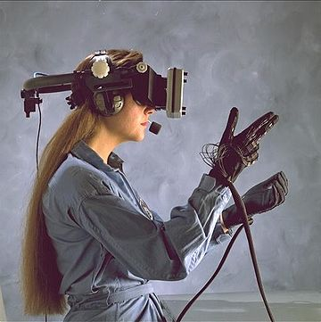
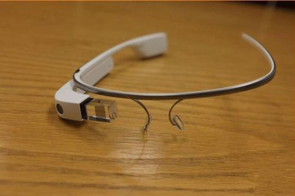
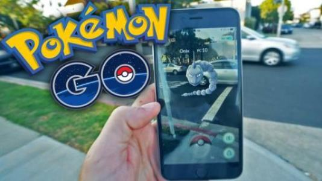
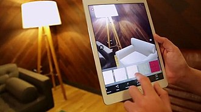
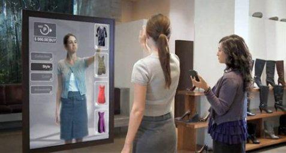

# VR与AR
## VR 虚拟现实
#### 虚拟现实（英语：virtual reality，缩写VR），该名词由迈伦·克鲁格创造，并从20世纪70年代使用至今。简称虚拟技术，也称虚拟环境，是利用计算机模拟产生一个三维空间的虚拟世界，提供用户关于视觉等感官的模拟，让用户感觉仿佛身历其境，可以即时、没有限制地观察三维空间内的事物。用户进行位置移动时，计算机可以立即进行复杂的运算，将精确的三维世界视频传回产生临场感。该技术集成了计算机图形、计算机仿真、人工智能、感应、显示及网上并行处理等技术的最新发展成果，是一种由计算机技术辅助生成的高技术模拟系统。
手眼虚拟现实
#### 从技术的角度来说，虚拟现实系统具有下面三个基本特征：即三个“I”immersion-interaction-imagination（沉浸—交互—构想），它强调了在虚拟系统中的人的主导作用。从过去人只能从计算机系统的外部去观测处理的结果，到人能够沉浸到计算机系统所创建的环境中，从过去人只能通过键盘、鼠标与计算环境中的单维数字信息发生作用，到人能够用多种传感器与多维信息的环境发生交互作用；从过去的人只能以定量计算为主的结果中启发从而加深对事物的认识，到人有可能从定性和定量综合集成的环境中得到感知和理性的认识从而深化概念和萌发新意。总之，在未来的虚拟系统中，人们的目的是使这个由计算机及其它传感器所组成的信息处理系统去尽量“满足”人的需要，而不是强迫人去“凑合”那些不是很亲切的计算机系统。
#### 现在的大部分虚拟现实技术都是视觉体验，一般是通过计算机屏幕、特殊显示设备或立体显示设备获得的，不过一些仿真中还包含了其他的感觉处理，比如从音响和耳机中获得声音效果。在一些高级的触觉系统中还包含了触觉信息，也叫作力反馈，在医学和游戏领域有这样的应用。人们与虚拟环境相互要么通过使用标准装置例如一套键盘与鼠标，要么通过仿真装置例如一只有线手套，要么通过情景手臂和/或全方位踏车。虚拟环境是可以是和现实世界类似的，例如，飞行仿真和作战训练，也可以和现实世界有明显差异，如虚拟现实游戏等。就目前的实际情况来说，它还很难形成一个高逼真的虚拟现实环境，这主要是技术上的限制造成的，这些限制来自计算机处理能力，图像分辨率和通信带宽。然而，随着时间的推移，处理器、图象和数据通讯技术变得更加强大，并具有成本效益，这些限制将最终被克服。
### VR应用：
#### 1.教育（如博物馆或培训等）
#### 2.娱乐（如游戏、电影，可以带来身临其境的体验）
#### 3.商业（如房地产场景化营销等）
## AR 增强现实
#### 增强现实（Augmented Reality，缩写AR）这个词语最早被前波音公司研究员 Tom Caudell在1990年所使用。也有对应VR虚拟实境一词的翻译称为实拟虚境，是指透过摄影机视频的位置及角度精算并加上图像分析技术，让显示屏上的虚拟世界能够与现实世界场景进行结合与交互的技术。这种技术于1990年提出。随着随身电子产品运算能力的提升，增强现实的用途也越来越广。
#### 目前对于增强现实有两种通用的定义。一是北卡大学教授罗纳德·阿祖玛（Ronald Azuma）于1997年提出的，他认为增强现实包括三个方面的内容：将虚拟物与现实结合；即时交互；三维室内设计运用。
#### 而另一种定义是1994年保罗·米尔格拉姆（Paul Milgram）和岸野文郎（Fumio Kishino）提出的现实-虚拟连续统（Milgram's Reality-Virtuality Continuum）。[3]他们将真实环境和虚拟环境分别作为连续系统的两端，位于它们中间的被称为“混合实境”。其中靠近真实环境的是增强现实（Augmented Reality），靠近虚拟环境的则是扩增虚境。
### 一般来说，AR设备的硬件包括光学投影系统、监视器、移动设备、头戴式显示器、抬头显示器、计算机。目前应用AR技术的大体有头戴式显示器（如google的project glass），抬头显示器（目前最知名的是Microsoft HoloLens），以及各种支持AR软件的移动设备（如iPhone、Windowsphone等）。
谷歌眼镜
### AR更多应用于游戏、娱乐方面，最著名的应该是曾经火遍全球的游戏Pokemon Go。

精灵宝可梦
### 但其实，在室内设计、购物等场景面AR也大有可为。

室内设计中的AR运用

AR试衣镜
## 感谢阅读！