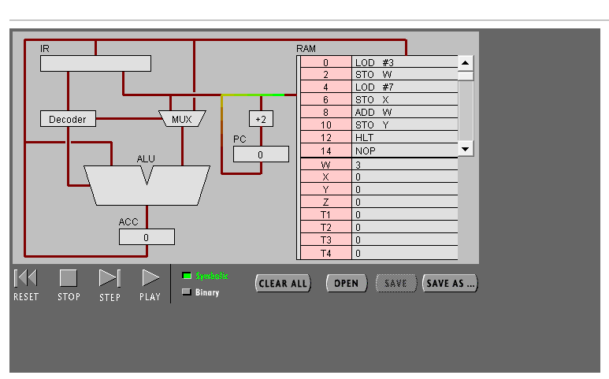
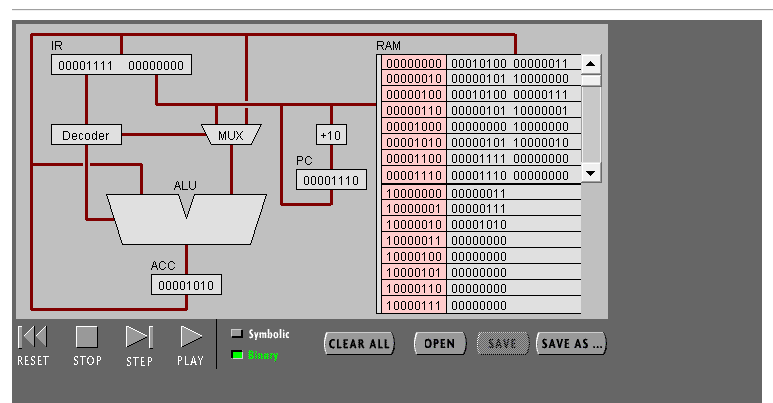
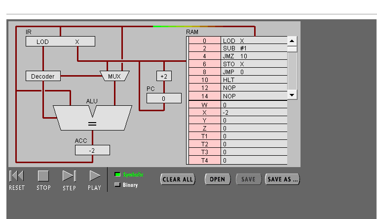
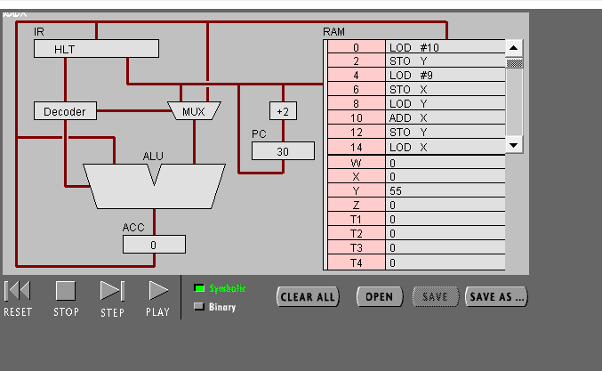
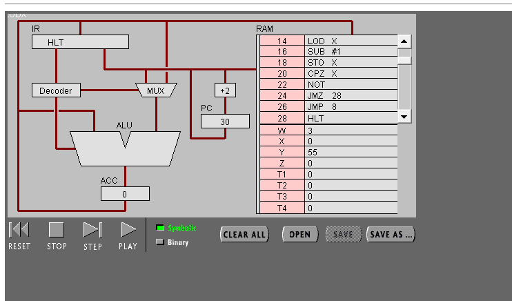

# 硬件编程–机器指令编程
### 18342013&emsp;&emsp;程泽楷

## 目录

1. [实验目标]("实验目标")
2. [任务1]("任务1：简单程序")
3. [任务2](任务2)
4. [实验小结](实验小结)

## 实验目标
### 理解冯·诺伊曼计算机的结构
### 理解机器指令的构成
### 理解机器指令执行周期
### 用汇编编写简单程序

## 任务1：简单程序

### （1）打开网页 The PIPPIN User’s Guide ，然后输入 Program 1：Add 2 number

### （2）回答问题
#### 1. PC，IR寄存器的作用：
##### &emsp;&emsp;PC: PC是专门用于在CPU取指令期间寻址程序存储器。PC总是保存着下一条要执行的指令的16位地址。 
##### &emsp;&emsp;IR:1.用来存放后续指令地址 
##### &emsp;&emsp;&emsp;2.保存当前正在执行的一条指令 
##### &emsp;&emsp;&emsp;3.保存将被存储的下一个数据字节的地址 
##### &emsp;&emsp;&emsp;4.保存当前CPU所访问的主存单元的地址

#### 2. ACC 寄存器的全称与作用。
##### &emsp;&emsp;ACC全称：accumulator，累加器
##### &emsp;&emsp;作用：主要用于完成数据的算数和逻辑运算，可以存放数据或中间结果。

#### 3. 用“LOD #3”指令的执行过程，解释Fetch-Execute周期。
##### &emsp;&emsp;(1)PC 根据地址从RAM取出指令LOD #3 
##### &emsp;&emsp;(2)指令传入IR，指令传入Decoder，无需取址，数字3传入MUX 
##### &emsp;&emsp;(3)数字3传入ALU之后传入ACC

#### 4. 用“ADD W” 指令的执行过程，解释Fetch-Execute周期。

##### &emsp;&emsp;(1)PC根据地址从RAM取出指令ADD W 
##### &emsp;&emsp;(2)指令传入IR之后传入Decoder 
##### &emsp;&emsp;(3)ALU从ACC中取值 
##### &emsp;&emsp;(4)IR再次访问RAM中的W，从W中取值 
##### &emsp;&emsp;(5)W的值读入ALU 
##### &emsp;&emsp;(6)ALU执行加法，结果传入ACC

#### 5. “LOD #3” 与 “ADD W” 指令的执行在Fetch-Execute周期级别，有什么不同。

##### &emsp;&emsp;LOD #3只需访问RAM一次,而ADD W需要两次访问RAM

### （3）点击“Binary”,观察回答下面问题

#### 此时程序已运行完毕。
#### 1.写出指令 “LOD #7” 的二进制形式，按指令结构，解释每部分的含义。

##### &emsp;&emsp; 00010100 00000111  前半部分是将操作数载入寄存器，后半部分为操作数7

### 2.解释 RAM 的地址。

#### &emsp;&emsp;RAM只用于暂时存放程序和数据，一旦关闭电源或发生断电，其中的程序和数据就会丢失

### 3.该机器CPU是几位的？（按累加器的位数）

#### &emsp;&emsp;8位

### 写出该程序对应的 C语言表达。
#### &emsp;&emsp;int w = 3;
#### &emsp;&emsp;int x = 7;
#### &emsp;&emsp;int y = w + x;

## 任务 2：简单循环

### （1） 输入程序Program 2，运行并回答问题：

### 1.用一句话总结程序的功能:
#### &emsp;&emsp;该程序是一个从零开始不停将x减去一的程序，不会停止。

### 2.写出对应的 c 语言程序

#### &emsp;&emsp;int x = -1;
#### &emsp;&emsp;while(i < 0){
#### &emsp;&emsp;x = x - 1;}

### （2） 修改该程序，用机器语言实现 10+9+8+..1 ，输出结果存放于内存 Y

# 
# 
### 1.写出 c 语言的计算过程

#### &emsp;&emsp;int x = 0;
#### &emsp;&emsp;int y = 10;
#### &emsp;&emsp;for (x = 9;x > 0;x--){
#### &emsp;&emsp;y = y + x;}

### 2.写出机器语言的计算过程

#### &emsp;&emsp;00 00010100 00001010 LOD #10
#### &emsp;&emsp;02 00000101 10000010 STO Y
#### &emsp;&emsp;04 00010100 00001001 LOD #9
#### &emsp;&emsp;06 00000101 10000001 STO X
#### &emsp;&emsp;08 00000100 10000010 LOD Y
#### &emsp;&emsp;10 00000000 10000001 ADD X
#### &emsp;&emsp;12 00000101 10000010 STO Y
#### &emsp;&emsp;14 00000100 10000001 LOD X
#### &emsp;&emsp;16 00010001 00000001 SUB #1
#### &emsp;&emsp;18 00000101 10000001 STO X
#### &emsp;&emsp;20 00001010 10000001 CPZ X
#### &emsp;&emsp;22 00001001 00000000 NOT
#### &emsp;&emsp;24 00001101 00011100 JMZ 28
#### &emsp;&emsp;26 00001100 00001000 JMP 8
#### &emsp;&emsp;28 00001111 00000000 HLT

#### 最后结果如图：
#  
### 3.用自己的语言，简单总结高级语言与机器语言的区别与联系。
#### &emsp;&emsp;机器语言和高级语言都能实现一些如循环、简单逻辑判断的功能，但是高级语言阅读更方便对人更友好，而机器语言读起来很复杂。

## 实验小结
#### &emsp;&emsp; 1.理解了冯诺依曼计算机的结构，对机器指令的构成有了一定认识，也大致明白了机器指令执行的周期（有多么漫长和单调）。

#### &emsp;&emsp; 2.虽然用汇编语言成功编程了从一到十累加的程序，但是耗时不可避免地长，这也让我体会到直接用机器语言来编程是多么繁杂和耗脑筋，高级语言确实对普通人来说更加友好。