# 用Construct 2制作大鱼吃小鱼游戏
## 1.游戏策划
### &emsp;&emsp;故事发生在漆黑无光的海洋，一只红身小鱼陷入了可怕的大鱼群，它必须找到办法确保自己的安全……
### &emsp;&emsp;玩法：使用上下左右键操控小红鱼躲避大鱼，碰到大鱼则死亡。通过吃到光点得分，每吃到一个光点得一分。吃到红色浮游生物得两分。
## 2.游戏设计：

##### Object：鲨鱼
##### Attribute：图片
##### Collaborator：精灵&emsp;&emsp;Event&Action：碰撞&消灭小红鱼
##### Event&Action：碰撞&消灭小红鱼
##### Object：鮟鱇鱼
##### Attribute：图片
##### Collaborator：精灵&emsp;&emsp;Event&Action：碰撞&消灭小红鱼
##### Object：黄鱼
##### Attribute：图片
##### Collaborator：精灵&emsp;&emsp;Event&Action：碰撞&消灭小红鱼
##### Object：蓝光
##### Attribute：图片
##### Collaborator：精灵&emsp;&emsp;Event&Action：碰撞小红鱼&消失，分数加一
##### Object：红色浮游生物
##### Attribute：图片
##### Collaborator：精灵&emsp;&emsp;Event&Action：碰撞小红鱼&消失，分数加二

### 1.加入物件
&emsp;&emsp;加入鲨鱼等鱼及光点、浮游生物的图片。
###### 海洋背景
插入背景图示，点击tile background
###### 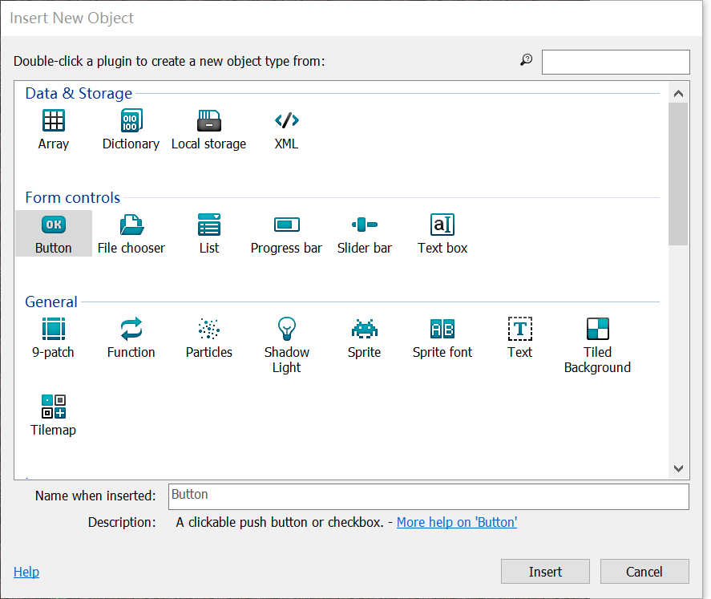
###### 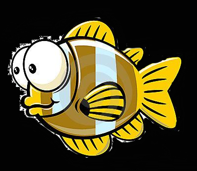黄鱼
###### 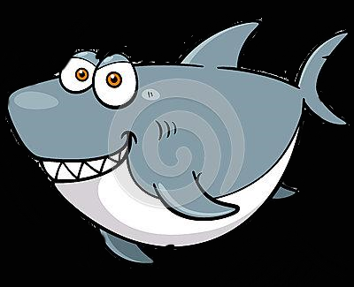鲨鱼
###### 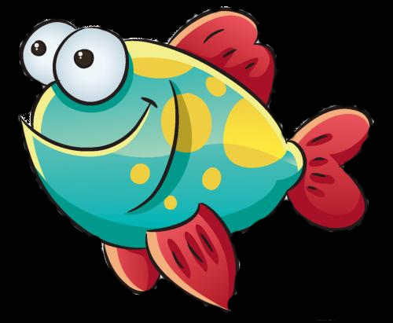小红鱼
###### 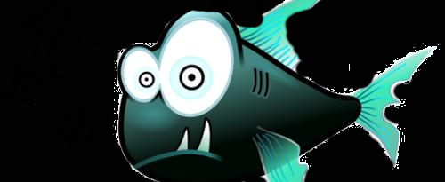鮟鱇鱼
###### 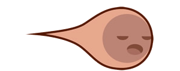浮游生物
###### 蓝色光点
#### 同理，加入如上物件只需要在弹出的对话框中点击精灵“Sprite”即可。
### 2.改变属性
&emsp;&emsp;在左侧的栏中找到add behaviors，点击，给除了小红鱼和背景以外的物件添加“Bullet”行为，给小红鱼添加“Eight direction movements”、“Scroll to”、“Bound to layout”行为。
# 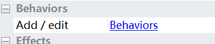
&emsp;&emsp;如果发现某些物件动的太快或太慢，可以在左边栏内改变速度“Speed”。
# 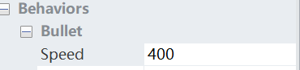
&emsp;&emsp;为了使图片自带的黑色背景隐去，可以在左侧栏中effects里的blend mode中将模式调成additive。
# 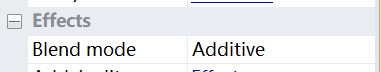
### 3.添加事件&动作
&emsp;&emsp;点击event sheet，双击添加新事件，选择系统“system”，再选择“on start of layout”，先设置各物件的角度。
# 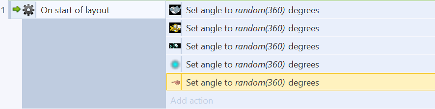
&emsp;&emsp;继续添加新event，双击选择鲨鱼，再选择“is outside layout”；之后add action，选择“set angle toward”，在弹出的对话框中将X坐标和Y坐标都设定为小红鱼的坐标。这样，每当鲨鱼要走出边框时候都会回头，转向小红鱼。
# 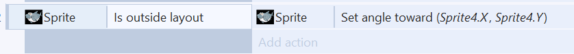
#### 同理，其余几种能吃小红鱼的鱼也要如法炮制。
&emsp;&emsp;针对蓝色光点被吃的问题，也要设计一个事件。双击，选择蓝色光点，再选择“on collision with another object”，之后add action，选择“destroy”。
# 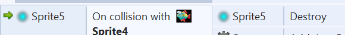
&emsp;&emsp;接下来，对于加分问题也要考虑。我们通过添加全局变量来搞定它。单击右键，选择“add global variable”，在弹出的对话框中把这个变量的名字设置为Score。
# 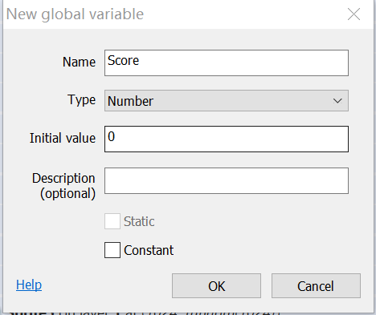
&emsp;&emsp;同时，对于怎么加分就有了凭证。在蓝色光点被吃事件中再添加一个动作，选择system，在对话框中选择“add to”，将全局变量增量设置为1。
# 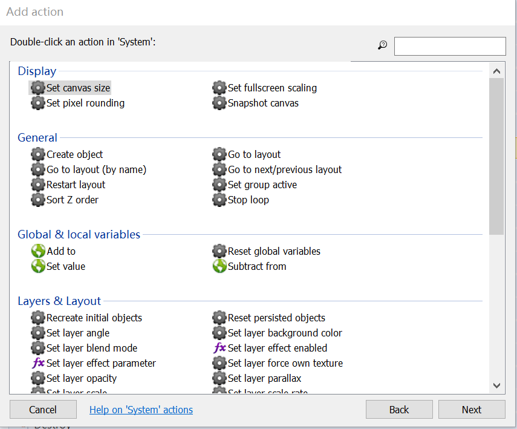
#### 同理，浮游生物的消失、加分也应进行大致相同的操作。
&emsp;&emsp;这时我们发现，小红鱼在碰到大鱼时不死亡，因此也应设计几个事件，让小红鱼碰到大鱼时消失（即死亡）。最后应如下图：
# 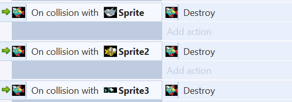
&emsp;&emsp;当光点和浮游生物都没了，游戏也就没有盼头了。所以我们要让光点和浮游生物能够自发产生。针对蓝色光点设计一个“重新产生”事件，并设定其重现出现的位置。对浮游生物也应如此操作，但时间间隔可以有所不同。
# 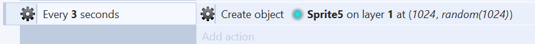
&emsp;&emsp;当吃掉东西时，需要有文字记录我们的分数，而之前已经设定了一个全局变量，它的变动即为分数变动，我们要做的就是让它显现出来。先在右上方操作栏处创造新的图层，并把旧的图层锁定。
# 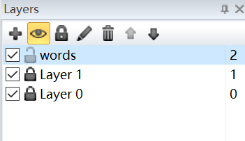
&emsp;&emsp;在新图层中双击，选择text。这时会有一个文本框出现，我们可以在左侧的属性栏中定义文字的大小、字体、颜色。再把目光转回event sheet上，这时候要让全局变量的变动和text挂钩。双击创造system事件，选择“every tick”，再add action，选择“Text”，再选择“Set text to”，在对话框中的双引号内打入Score（中文输入会变成乱码），双引号外打&Score，这里和编程里的取地址很像，是把全局变量Score的量拿到这里来用。
# 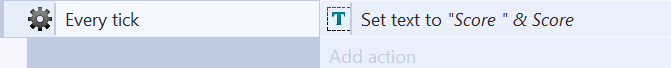
## 现在，这个大鱼吃小鱼的游戏已经大致完成了，我们可以在上方点击“Run layout”，在浏览器中进行游戏。游戏预览如下效果：
# 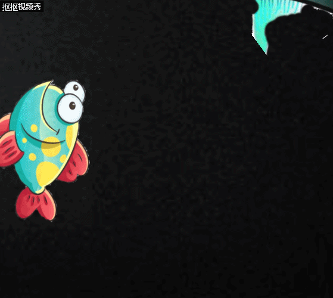