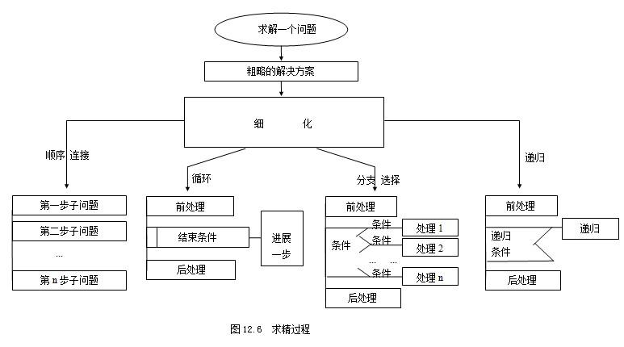

# 洗衣机算法设计
## 主要思想介绍
### 自顶向下，逐步求精：

&emsp;&emsp;这个方法指的是对大问题的分解，即将我们遇到的复杂的，所谓“大”的问题，可以根据重要程度一层一层地分解为小问题，从而便于解决。它主要可分为如下四种求精技术：
##### 1.顺序连接的求精：当子问题具有前后关系时，将问题分成互不相关的子问题按顺序执行；
##### 2. 分支、选择的求精：当问题在不同情况下解不同时候选择该技术。
##### 3. 循环的求精：如果有向解的方向前进一步的方法，且不断重复该步骤，即能解决问题，最终达到完全解。则应该采用循环的求精，但要注意循环的初始条件、结束条件。
##### 4. 递归的求精：当问题的某步解法与前边高层次的某步解法具有相同特征属性，只是某些参数不同时，可采用递归的求精。这时应注意递归的参数变化规律以及递归出口。

### 采用自顶向下，逐步求精编程的优点：
#### 1. 程序的层次分明、结构清晰。
#### 2. 便于集体开发程序。对于大型程序来讲，可以每组负责一个模块（一个子部分），在一个组内又可以每个人负责一个子模块（更小的子部分）等等。而各个模块之间以及各个子模块之间相对独立，互相之间没有制约，各个模块的负责人员可以独立的进行各自的程序设计。
#### 3. 便于调试。若程序有错误，可以很容易的将错误局部于某一子部分，找出错误，同时每一部分的错误是独立的，也不至于影响其它的部分。

## 以洗衣机为例讲解该设计方法：
### &emsp;&emsp;用洗衣机洗衣服，可以分为如下步骤：选择模式、注水、浸泡、洗涤、脱水、断电。
### &emsp;&emsp;以注水这一项为例，继续精化：
#### 1.先读取用户选择的水量（READ water-level)；
#### 2.关闭排水口(close outfall)；
#### 3.打开入水口(open outlet)；
#### 4.实时水量检测；
#### 5.进行判断，若水量达到设定要求，则关闭放水口，进入下一环节（浸泡、洗涤等）。
### 用伪代码表示上述过程：
#### READ water-level
#### close outfall
#### open outlet
#### WHILE water < water-level
#### &emsp;&emsp;inject water
#### END WHILE
#### IF water == water-level
#### &emsp;&emsp;close outlet
#### END IF
#### 如上则是注水过程的伪代码程序。如果能把我们的操作转化为机器可识别的程序，只对某些参数做出更改，我们便可以对洗衣机的模式进行选择。在注水方面，我们可以选择水量；在浸泡方面可以用计时程序来控制浸泡时间；在洗涤方面可以控制电机的转速、次数等，这样就把看似复杂的问题给简化了，距离达成目标就又近了一步。