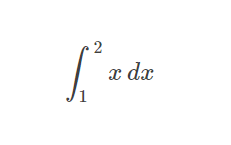
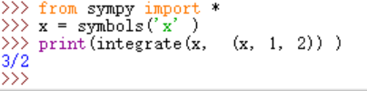
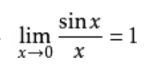
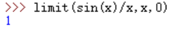
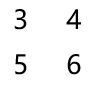
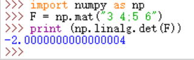
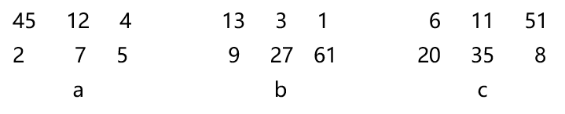
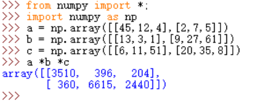

# 用 python 做计算器，做数学题
## 一、使用Python求解高等数学问题
### 1. 求定积分

# 
### Python代码：
### &emsp;&emsp;from sympy import *
### &emsp;&emsp;x = symbols('x' )
### &emsp;&emsp;print(integrate(x,  (x, 1, 2)) )
### 结果如下图
# 

### 2. 求极限

# 

### Python代码：
### &emsp;&emsp;limit(sin(x)/x,x,0)

### 结果如下图
# 

## 二、使用Python求解线性代数问题
### 1. 求矩阵的行列式

# 

### Python代码：
### &emsp;&emsp;import numpy as np
### &emsp;&emsp;F = np.mat("3 4;5 6")
### &emsp;&emsp;print (np.linalg.det(F))

### 结果如下图
# 

### 2. 求矩阵的积

# 

### Python代码：
### &emsp;&emsp;from numpy import *; 
### &emsp;&emsp;import numpy as np
### &emsp;&emsp;a = np.array([[45,12,4],[2,7,5]])
### &emsp;&emsp;b = np.array([[13,3,1],[9,27,61]])
### &emsp;&emsp;c = np.array([[6,11,51],[20,35,8]])
### &emsp;&emsp;a *b *c

### 结果如下图
# 

