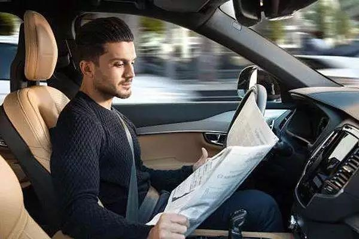
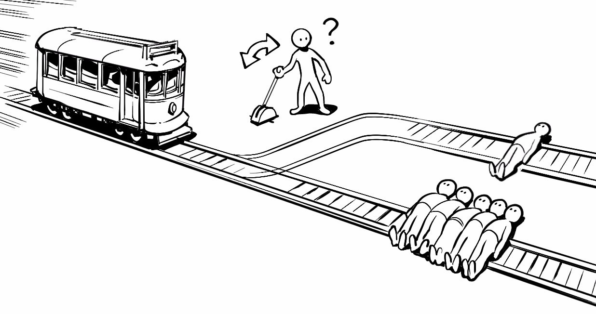

# IT伦理与道德研究——自动驾驶引发的伦理问题
### &emsp;&emsp;近年来，自动驾驶技术已经变得越来越热门，不少公司纷纷入局。

### &emsp;&emsp;诚然，自动驾驶的便利图景让人浮想联翩。可是，尽管自动驾驶以安全为标签，我们仍然不能不考虑突发事件到来的情况，而危急时刻机器的选择，恰恰挑战了我们的伦理与道德。说到道德问题就不得不提著名的“电车难题”：“远处开来一辆火车，前面是两条岔路，你手头有一个扳道岔，你如果不扳，火车就会走原路撞死五个人；如果你扳了，火车就会走上岔路撞死一个人。请问你是扳还是不扳呢？”

### &emsp;&emsp;面对自动驾驶，“电车难题”又有了延伸：如果让自动驾驶的汽车在危机的情况下来做决断，那么决断规则由谁确定？假如出了交通事故，又是谁来承担可能造成的后果？
### &emsp;&emsp;对此，世界上有不同的声音。
### &emsp;&emsp;德国车辆制造商梅赛德斯表示，梅赛德斯将优先保护车上人员安全，该公司同时指出电车难题不是一个真正的问题，因为公司将“致力于提高和完善技术和风险防范策略，完全避免两难情况的出现”。

### &emsp;&emsp;瑞安·卡洛(Ryan Calo)是华盛顿大学的机器人学法专家，他对现有理论层面的伦理讨论是否可能转化为实际规则或制度设计表示怀疑。他认为自动汽车不够精密，不足以了解在实际场景中人类将作出的不同反应。 

### &emsp;&emsp;谷歌自动驾驶汽车之父 Sebastian Thrun 在接受彭博社采访时表示，自动驾驶汽车在设计之初就是为了避免事故发生，不过如果真的避无可避，它会选择牺牲“更小”的事物。这也是在暗示，在遇到电车问题时，他倾向于“杀少救多”。

### &emsp;&emsp;英国的MAP项目办公室的设计总监乔恩·马歇尔（Jon Marshall）和他的团队提出一种方案：在一个城市内的不同区域，所有的汽车都应设置成一个特定的模式，比如在学校区域，也许所有的汽车应该被要求处于“利他”的模式（即优先考虑行人）。而如果在高速公路上行驶，所有的汽车都应该被授权为“自我保护模式”。

### &emsp;&emsp;除了电车难题，自动驾驶汽车可能还会遇到以下吊诡的场景，解决起来也不容易：

### &emsp;&emsp;&emsp;&emsp;1. 自动驾驶汽车在路上行驶时发现路两边有两拨行人，一拨人数多，而另一拨则只有一人。这时它是否应该给人数更多的那拨行人留下更多安全空间？如果这样做了，是否会增加那位独行行人被撞的几率？

### &emsp;&emsp;&emsp;&emsp;2. 自动驾驶汽车是否应该学习人类驾驶员，在大卡车驶过时主动让出更多空间？这样会不会增加自己撞到另一边车道上车辆或行人的可能？

### &emsp;&emsp;&emsp;&emsp;3. 如果自动驾驶汽车的词典里就没有“撞击行人”这个词，那么一旦有人要自杀（主动撞车），车辆是否会失控？

### &emsp;&emsp;&emsp;&emsp;4. 如果一只狗突然冲了出来，或者麋鹿、松鼠之类，自动驾驶汽车是会直接撞过去？加速或刹车躲避？这样是不是就会增加撞到其他车辆的可能性？
### &emsp;&emsp;尽管大家都对解放双手出行的前景抱有幻想，但显然，没有统一且令人接受的标准去解决如上及一些未能预见的问题的话，大规模推行自动驾驶的日子不会太早到来。17年德国出台了全球首套自动驾驶伦理准则，算是开了个先河。该伦理准则由德国联邦交通与数字基础设施部下设的伦理委员会起草，共有20条，其大致内容可归结如下：
### &emsp;&emsp; 1.自动驾驶的首要目标是提升所有交通参与者的安全，在同等程度上降低所有交通参与者的风险；

### &emsp;&emsp; 2.自动驾驶系统要同等对待所有交通参与者，不能有任何歧视，也不能直接做出「撞一个救五个」的决定；

### &emsp;&emsp; 3.人的生命安全优先于其他利益，在发生事故时，可以牺牲财产及动物的生命，以保护人的生命安全；

### &emsp;&emsp; 4.必须清晰界定机器和人的责任，机器不能取代或优先于人的自主决定权，面对不可避免的事故，最终的行为决定权还要由人掌握；

### &emsp;&emsp; 5.除了技术投放之外，也应该教会人如何使用自动驾驶系统。