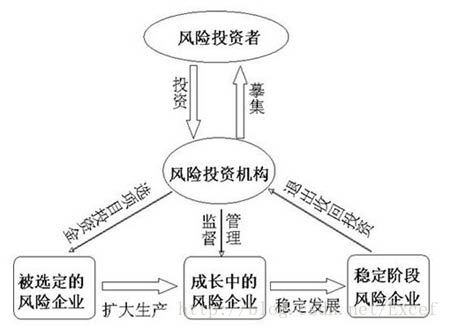
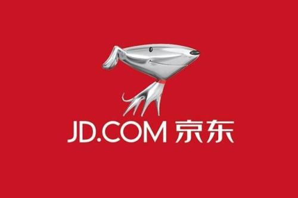
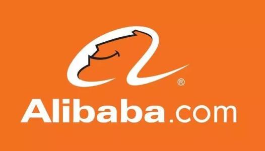
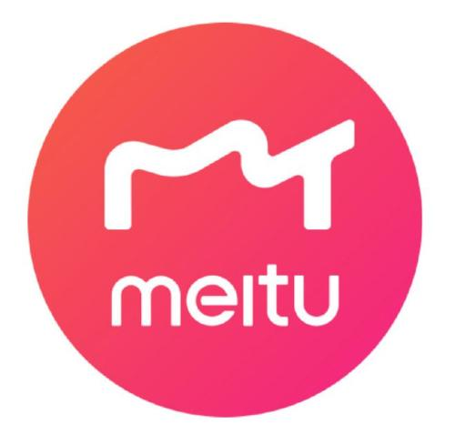

# IT风投之我见

## 最近IT风投越来越成为一个热门的行业，不少资本力量纷纷入局。那么，什么是IT风投呢？

&emsp;&emsp;风险投资（英语：Venture Capital，缩写为VC）简称风投，又译称为创业投资，主要是指向初创企业提供资金支持并取得该公司股份的一种融资方式。风险投资是私人股权投资的一种形式。风险投资公司为一专业的投资公司，由一群具有科技及财务相关知识与经验的人所组合而成的，经由直接投资获取投资公司股权的方式，提供资金给需要资金者（被投资公司）。风投公司的资金大多用于投资新创事业或是未上市企业（虽然现今法规上已大幅放宽资金用途），并不以经营被投资公司为目的，仅是提供资金及专业上的知识与经验，以协助被投资公司获取更大的利润为目的。（来源：百度百科）

&emsp;&emsp;自然，IT风投也就是在IT领域的风险投资。大家都知道，IT技术以前所未有的速度和广度深刻地改变了我们的生活，IT新技术的发展往往又能给我们的生活带来新的便利，同时也为商人带来可观的收益，因此不少资本会投入到新兴的、迅速发展的、具有巨大竞争潜力的企业中，以期扶持其成长从而持续获益。当然了，就像任何硬币都有两面一样，IT具有很大的潜力，也有很大的风险。
## IT风投在中国

&emsp;&emsp;近几十年来，风投对中国IT界的发展起到了很大的作用。因为风险投资不需要抵押，也不需要偿还。如果投资成功，投资人将获得几倍、几十倍甚至上百倍的回报;如果失败，投资者也只能自己承担损失。对当时的IT创业者来讲，在中国发展IT行业的潜力是巨大的，但风险也是极高的，因为创新需要有很高的要求。所以，对于创业者，使用这种投资方式创业的最大好处在于即使失败，也不会背上债务，这样就使得年轻IT人创业成为可能。

### &emsp;&emsp;下面是国内近年来比较大的几个风投项目：
#### 2006年，中国电商公司京东的创始人刘强东寻求200万美元的资金支持。为此，他向中国私募资本公司Capital Today寻求帮助。结果，Capital Today决定投资1000万美元。当京东在2014年上市的时候，Capital Today的股权价值24亿美元。

#### 2014年，阿里巴巴股票筹资额达到220亿美元，这成为迄今为止最大规模的首次公开募股。这次IPO让阿里巴巴的市值达到了2310亿美元，而软银在阿里持有的股份价值也超过了600亿美元。

#### 2016年，中国图片编辑应用美图上市，公司市值达到49亿美元，且在IPO筹资中拿到了6.3亿美元。这对中国科技市场来说是一个里程碑式的事件。美图的早期投资者Sinovation Ventures获得了40倍的投资回报。

### &emsp;&emsp;以及国内几个较为知名的IT风投公司：
#### 软银中国创业投资有限公司（日本孙正义资本，投资过阿里巴巴，盛大等公司），投资领域： IT服务 软件产业 半导体芯片 电信通讯 硬件产业 网络产业

#### 红杉资本中国基金 （美国著名互联网投资机构，投资过甲骨文，思科等公司）
#### 联想投资有限公司（国内著名资本），投资领域： 软件产业 IT服务 半导体芯片 网络设施 网络产业 电信通讯

### 中国IT风投现状
#### &emsp;&emsp; 1. 缺少熟谙风险投资的人才
#### &emsp;&emsp; 2. 缺少适宜风险投资发展的法制法规环境
#### &emsp;&emsp; 3. 从规模到效益上在逐渐追赶以美国为主的发达国家
#### &emsp;&emsp; 4. 民间资本逐渐进入风投领域，如科技和互联网新贵们发起的风险投资机构

## 总结
在提倡创业创新和风投产业不断发展的大背景下，新鲜的想法落地变为现实的可能性越来越高。未来，软件工程的学生也可能走上寻求风投（甚至是进行风投）的道路，我们有理由相信中国的风投产业会越来越好，增加社会创新活力，推动新技术、新工具的出现，最终造福人类整体。

