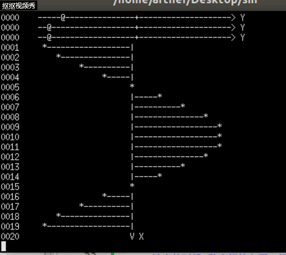
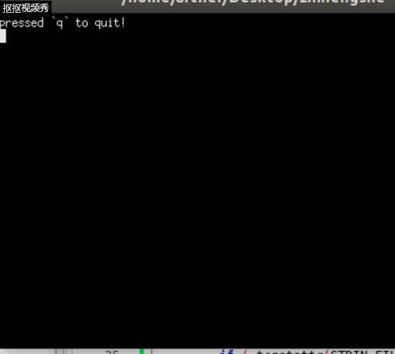
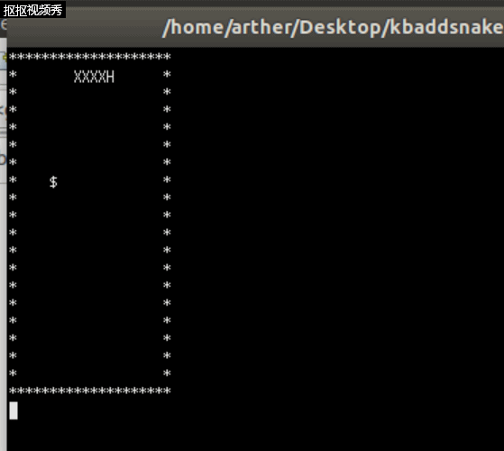
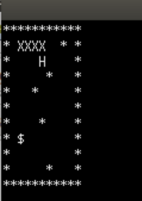
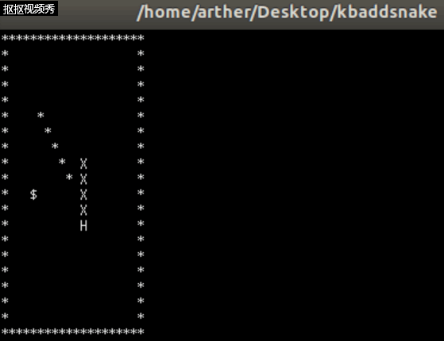
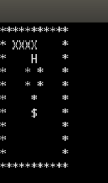

# 智能蛇实验报告
## 一、编译并运行sin-demo.c（图片如下）


## 二、实现 kbhit() （图片如下）


## 三、将贪吃蛇的代码加入


## 四、编写智能算法

### 1.请修改初始化字符矩阵，或者通过文件读入地图。地图中有一些你设定的障碍物（墙），效果如下：



### 2.请实现如下算法决定蛇行走的方向

### 代码如下：
```
   char whereGoNext(void)
{
    char move[4] = {'a', 'd', 'w', 's'};
    int minDistIndex = 0;
    int distance[4] = {0, 0, 0, 0};
    int i = snakeLength - 1;
    int dx = 0, dy = 0;
    int moveIndex = 0;
    for (moveIndex = 0; moveIndex < 4; moveIndex ++) 
    {
        switch (move[moveIndex]) 
        {
            case 'a':
                dx = -1;
                dy = 0;
                break;
            case 'd':
                dx = 1;
                dy = 0;
                break;
            case 'w':
                dx = 0;
                dy = 1;
                break;
            case 's':
               dx = 0;
                dy = -1;
                break;
            default:
                break;
        }
        if (map[snakeY[i] - dy][snakeX[i] + dx] == '$') 
        {
            return move[moveIndex];
        }
        else if (snakeX[i] + dx == snakeX[i - 1] && snakeY[i] - dy == snakeY[i - 1])
        {
            distance[moveIndex] = 9999;
        }
        else if (map[snakeY[i] - dy][snakeX[i] + dx] != ' ')
        {
            distance[moveIndex] = 9999;
        }
        else
        {
            distance[moveIndex] = abs(foodX - (snakeX[i] + dx)) + abs(foodY - (snakeY[i] - dy));
        }
        if (distance[minDistIndex] > distance[moveIndex]) 
        {
            minDistIndex = moveIndex;
        }
   }
    if (distance[minDistIndex] == 9999) {
        isGameOver = 1;
    }
    return move[minDistIndex];
}
```
### 效果如下：


### 3.思考：一个长度为5的障碍物能困死该自动跑的蛇吗？

### 可能，在我的算法里遇到如下情况智能蛇会撞上去。




## 总结：linux系统的稍显卡顿真的让新手有些吃不消，它与win10编译环境的不一样也导致一些代码不能在win10上运行。不过经过这次实验，我大概摸着了linux的一点门道，对以后的使用算是做了个铺垫。