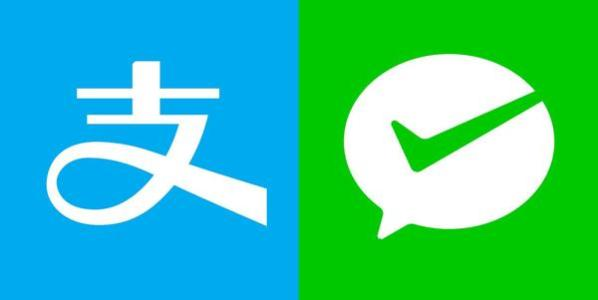

# 互联网时代的盈利模式

## &emsp;&emsp;有句话说得好：“流量为王互联网项目永恒的主题”。而流量这个词在近年来也被赋予了不同的含义。它到底是什么意思呢？百度百科的释义如下：
### &emsp;&emsp;“流量”本义是单位时间内通过河、渠或管道某一横截面的流体的量，或是通过道路的车辆、人员等的数量。在互联网时代，“流量”也指在一定时间内网站的访问量，以及手机等移动终端上网所耗费的字节数。明星大腕显然能让网站访问流量以及手机等移动终端上网流量暴增。从2016年年底、2017年年初开始，娱乐圈频频用“流量”来形容那些粉丝多、人气高、影响广、商业价值大的明星。这里面既有市场层面的客观描述，又隐含着公众的文化评价，是一个耐人寻味的词语。

## &emsp;&emsp;介绍完流量，我们来聊聊互联网时代里围绕流量展开的的一些盈利模式。总的来说，互联网盈利模式分为三种：广告，增值服务和佣金。

### 一、广告
# 
### &emsp;&emsp;广告无处不在，作为互联网免费时代的代价，广告充斥着互联网的每个角落。视频音乐、新闻资讯、搜索、电商、游戏，广告可以渗透到各种互联网产品之中。按照呈现载体不同，广告可分为文字广告、图片广告、视频广告等等。相比于传统媒体，互联网产品覆盖面更广，广告形式更丰富，有启动屏广告、横栏广告、私信广告、视频广告等，人群定位更精准，因此具有独特的优势。

### 二、增值服务
# 
### &emsp;&emsp;大多数互联网游戏的盈利模式都属于增值服务，很多游戏可以免费玩，但是你想要更炫酷的皮肤，更强大的技能，游戏内更高的地位，你就得充值。这属于典型的增值服务——产品的基础功能免费，高级功能收费。视频网站也是如此，它们的付费视频，也是类似的思路——基本内容免费，高级内容收费。
### 三、佣金
# 
### &emsp;&emsp;大多数互联网巨头都属于平台模式。平台不直接生产创造价值，而是通过连接不同商业群体来整合价值。美团点评、滴滴出行、携程、饿了么等O2O巨头，均是通过促成团购、打车、酒旅、外卖等商业交易，并从中提取一定的佣金而盈利。佣金、交易提成、交易手续费等等说法都是一个道理。

## &emsp;&emsp;此外，还有一种新兴的盈利模式：知识付费。知识付费大致分为以下三种：
### 1.阅读/课程付费：有经验、有能力的内容提供者可将自身理论知识、认知积累，形成干货类、实用类文章，供有需要的用户付费阅读。
# 
### 2.直播付费：直播互动可以说是近年来大热的内容形式，除了游戏直播、美女直播等形式，知识教学类直播也易军突起，内容制作者可在直播过程中发放任务红包、提高用户粘性，分享商城链接或购物券，获取额外收入。
# 
### 3.电台付费：与直播相比，音频内容的场景适用性更强，对于自配时间少的上班族来讲，电台音频内容是最方便的一种形式，上下班途中可以学上一课，也提供一些不愿露脸的内容创造者进入该行业，减少化妆、布置现场等时间和经费。
# 

## 总之，互联网时代的盈利模式具有多种可能性，而它们更可以有机结合。围绕着让产品赚更多钱的想法，新的盈利模式将不断被创造出来并被使用。看似眼花缭乱的商业浮华，背后的根源都离不开人。移动互联时代，只有紧紧抓住用户的心，才能无止尽的斗争中占得自己的一方天空。