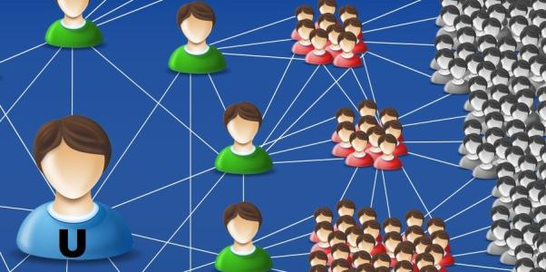

# 互联网时代的热点领域选择、营销方法简介

## 1.共享经济
&emsp;&emsp;据百度百科，共享经济是指以获得一定报酬为主要目的，基于陌生人且存在物品使用权暂时转移的一种新的经济模式。其本质是整合线下的闲散物品、劳动力、教育医疗资源。有的也说共享经济是人们公平享有社会资源，各自以不同的方式付出和受益，共同获得经济红利。此种共享更多的是通过互联网作为媒介来实现的，目前较为知名的有共享单车、共享汽车等。

共享经济的营销模式主要有如下几种：  

&emsp;&emsp;1.收取押金，获得庞大现金流做投资；  

&emsp;&emsp;2.收取广告费；  

&emsp;&emsp;3.收取个人看来“少量”租金，但当用户数量多起来之后其实利润也挺可观。除此之外， 共享的理念由于能够整合社会零散资源，值得提倡，用户量自然也不愁。

## 2.大数据
&emsp;&emsp;据麦肯锡全球研究所给出的定义，大数据是一种规模大到在获取、存储、管理、分析方面大大超出了传统数据库软件工具能力范围的数据集合，具有海量的数据规模、快速的数据流转、多样的数据类型和价值密度低四大特征。

大数据的营销模式：  

&emsp;&emsp;1.构建大数据系统并提供维护服务，构建系统是为人所用，有些像基础设施建设。

&emsp;&emsp;2.构建大数据交换共享平台。由于存在于网络中的信息碎片是独立错乱的，要想利用，就需要将这些信息打通、链接，进行信息共享，实现用户的精准识别和数据汇集。  

&emsp;&emsp;3.利用大数据信息采集工具实现精准营销和用户维系，比如通过云速数据挖掘，采集筛选精准需求客户信息，再进行一对一产品信息推广，以提高营销转化率。  

## 3.人工智能  
&emsp;&emsp;人工智能，英文缩写为AI，是研究、开发用于模拟、延伸和扩展人的智能的理论、方法、技术及应用系统的一门新的技术科学。

人工智能的营销模式：  

&emsp;&emsp;1.人工智能优化营销数据搜集和处理方式。  

&emsp;&emsp;2.由人工智能提供个性化的营销策略。在数据量足够的情况下，依据真实可靠的数据，在对数据快速分析下，通过建立数据模型，后方企业的人工智能技术可以为营销人员提供策略建议，并将信息发送至体验店中，及时调整营销策略。  

&emsp;&emsp;3.用人工智能改变广告投放方式。人脸识别技术的发展可以让广告投放因人而异。例如，在数字广告牌上安装软件和网络摄像装置。广告牌利用人脸识别技术，识别观看者的体貌特征和观看广告的市场等信息。企业利用搜集到的数据信息来作为衡量广告投放效果的，从而合理选择广告投放人群和区域。在电商领域，人工智能技术还可以根据客户个人资料和偏好，经过数据分析，把具有相似特征和购买偏好的客户归类，并据此进行有针对性的广告推送。  

## 此外，互联网的兴起还带火了好些营销策略：

&emsp;&emsp;1.饥饿营销：指商品提供者有意调低产量，以期达到调控供求关系、制造供不应求“假象”、以维护产品形象并维持商品较高售价和利润率的营销策略。  

&emsp;&emsp;2.病毒营销：来自消费者自己或家人朋友的消费体验往往比广告广告宣传更具有说服力。企业可以争取“口碑领导者”或“意见领袖”的好感，然后利用他们各自的言论渠道或者诸如微博、公众号等一些网络平台发布消费意见，这不失为网络时代的一种营销利器。  

&emsp;&emsp;3.借势营销：借势营销通过创意将产品附着在有巨大传播力、大家众所周知的热点事件或节日上，很容易就会获得大量传播。比较知名的例子有避孕套品牌杜蕾斯的蹭热度；最近的例子有综艺节目“中国新说唱”，不少品牌借由该节目的知名度，加上嘻哈风格的广告，赢来了大波关注。  

